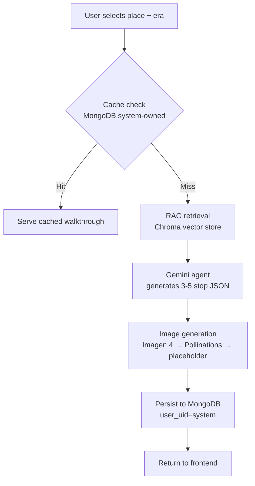

# Yatra

Yatra is an AI-generated historical walkthrough app. A user picks a place and an era; the backend retrieves grounded historical context via RAG, generates a 3–5 stop narrated walkthrough with images, and serves it as an interactive, shareable experience.

## How it works

1. **Search** — user selects a place and era on the frontend.
2. **Global cache check** — MongoDB is checked for an existing `system`-owned walkthrough for that exact place/era. If found, served instantly.
3. **RAG retrieval** — on a cache miss, a local Chroma vector store is queried for historically grounded context.
4. **Agent generation** — a Gemini agent turns that context into a structured 3–5 stop JSON walkthrough (second-person narration, daily-life facts, continuity-aware image prompts).
5. **Image generation** — each stop's image prompt runs through a fallback chain: Imagen 4 (fast → standard → ultra) → Pollinations.ai → transparent placeholder.
6. **Persistence** — the finished walkthrough (including Base64 image URLs) is saved to MongoDB under `user_uid="system"` and returned to the frontend.

Users can also save a copy to their own account (clone, not move) and generate an 8-character share slug for public, unauthenticated viewing.

## Tech stack

| Layer | Technology |
|---|---|
| Frontend | React + Vite + Tailwind, state-based routing (no router library) |
| Backend | FastAPI (Python), routes mounted in `main.py` |
| Agent | Google Gemini (`google.genai` SDK) |
| RAG / Vector store | Chroma, local + persistent, runs in a thread pool off the asyncio loop |
| Image generation | Imagen 4 tiers → Pollinations.ai HTTP fallback → static placeholder |
| Auth | Firebase Auth (Google OAuth), JWT `idToken` in `Authorization` header |
| Database | MongoDB (global cache + per-user history + share slugs) |

## Architecture notes

- **Frontend** uses conditional state rendering rather than `react-router-dom`. `App.tsx` owns `user`/`idToken` context and renders `<Dashboard>` or `<LandingPage>`. `<WalkthroughModal>` is injected at the top level so guests can open shared links without authenticating.
- **Backend** is organized into an API layer (`backend/api/walkthrough.py`), a RAG pipeline (`backend/rag/`), an agent engine (`backend/agent/`), and an image fallback pipeline (`backend/services/image_gen.py`).
- **Save vs. clone**: saving a walkthrough clones the `system` document with a new UUID and the user's UID, clears any `share_slug`, and leaves the original in the global cache untouched.

## API reference

All routes mounted directly via `main.py`.

| Method & Path | Auth | Purpose |
|---|---|---|
| `GET /api/walkthrough/places` | No | Returns the 25 statically supported place/era combinations |
| `POST /api/walkthrough` | No | Direct RAG + AI generation, no caching/DB check |
| `POST /api/walkthrough/start` | No (defaults to `user_uid="system"`) | Cache check → generate → generate images → save to global pool |
| `GET /api/walkthrough/mine` | Yes | Thumbnail summaries of the authenticated user's walkthroughs |
| `POST /api/walkthrough/{id}/save` | Yes | Clones a system walkthrough into the user's account |
| `POST /api/walkthrough/{id}/share` | Yes | Validates ownership, generates an 8-char slug |
| `GET /api/walkthrough/shared/{slug}` | No | Public retrieval for shared links |
| `GET /api/walkthrough/{id}` | No | Public retrieval by exact ID (used by History tab) |
| `GET /api/walkthrough/{id}/stop/{n}` | No | Polling endpoint for per-stop image generation status |

`POST /api/walkthrough/start` payload: `{"place": "string", "era": "string", "rag_context": "string (optional)"}`

## Environment variables

| Variable | Used by |
|---|---|
| `GEMINI_API_KEY` | Agent — world-state generation |
| `OPENAI_API_KEY` | Embeddings + image generation |
| `CHROMA_PERSIST_DIR` | RAG vector store path |
| `NEXT_PUBLIC_API_URL` | Frontend — backend base URL |
| `FIREBASE_ADMIN_SDK_JSON` | FastAPI — Firebase Admin SDK service account (keep secret) |
| `MONGODB_URI` | FastAPI — MongoDB connection string (keep secret) |
| `NEXT_PUBLIC_FIREBASE_CONFIG` | Frontend — Firebase client config (public, safe to expose) |

## Known gaps / tech debt

1. **Hardcoded search inputs** — `Home.jsx` uses free-text/hardcoded selects instead of calling `GET /api/walkthrough/places`, so users can submit unsupported combinations and get a 400.
2. **Deprecated Imagen models** — `imagen-4.0-fast-generate-001` and related tags are slated for deprecation in late 2026; migration to `imagen-3.0-generate-001` or native Gemini image paths is needed eventually.
3. **No shared-link error UI** — a failed `/shared/[slug]` fetch only logs to console; there's no "Walkthrough Not Found" state for guests.
4. **Base64 images stored in MongoDB** — Pollinations and placeholder images are saved as Base64 data URIs directly in documents, which bloats the DB. The intended fix (upload to Firebase Storage, store only the CDN URL) is stubbed but unimplemented.

